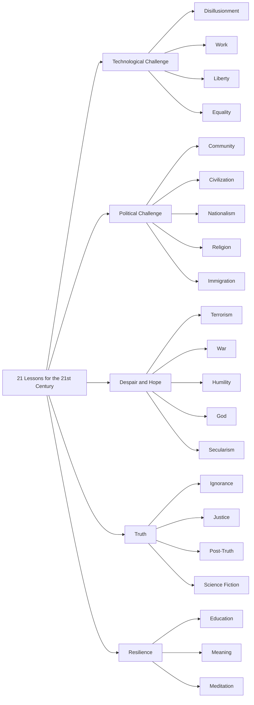

# Introduction
What does it mean to thrive in a world shaped by rapid technological change, political upheaval, and existential crises? In 21 Lessons for the 21st Century, Yuval Noah Harari tackles this question, offering a thought-provoking guide to navigating the challenges of our time. This blog post dives into the first part of the book, exploring the Technological Challenge and its four key lessons: disillusionment, work, liberty, and equality (and community). I’ll share my thoughts on each lesson, highlight the book’s strengths and weaknesses, and give it a score.

> If the future of humanity is decided in your <u>absence</u>, because you are too busy feeding and clothing your kids - you and they will not be exempt from the <u>consequence</u>. This is very unfair; but who said history was fair?

# Why Read This Book
*21 Lessons for the 21st Century* encourages you to ponder some of the most pressing challenges we face today, from AI’s impact on jobs to the erosion of personal liberty. Harari doesn’t just describe these issues—he challenges you to think critically about your role in shaping the future. This book is perfect for anyone curious about where humanity is headed.

# Structure of the Book

# Book Deep Dive
Now it's time to explain each `lesson` of Yuval separately and give my own opinion.
## Disillusionment: Is Liberalism Failing Us?

Harari argues that liberalism, once hailed as the ultimate political ideology, is faltering. Its shortcomings include:
- **Ecological collapse**: Rapid economic growth is destroying nature.
- **Technological disruption**: Our reliance on technology risks making humans irrelevant.

In the past, people fought exploitation by elites. Today, the struggle is against becoming obsolete. Harari doesn’t offer solutions, which is frustrating but forces us to think for ourselves.
**What do you think?** Can we balance economic growth with environmental sustainability?

## Work: Will AI Redefine Our Jobs?

This lesson explores how AI will transform jobs. Harari emphasizes that we should protect humans, not jobs. AI can combine connectivity with individuality, but are we mentally ready to adapt? Jobs may change yearly, requiring constant learning.

Creativity isn’t our saving grace either. If an AI chess model makes moves no human ever considered, isn’t that creative? The future isn’t about human vs. AI—it’s about collaboration. For more on this, check out my post on the [future of jobs](/posts/future_of_tech_jobs/).

**What do you think?** Are you ready to reinvent your career every few years?

## Liberty: Are We Truly Free?

Harari questions our freedom in an algorithm-driven world. Soon, algorithms may know us better than we know ourselves, guiding our decisions. This saves time but erodes liberty. Is that a bad thing? Algorithms can optimize choices, but at the cost of autonomy.

For a fictional take on this, watch the anime *[Psycho-Pass](https://en.wikipedia.org/wiki/Psycho-Pass)*, where a system predicts people’s behavior.

**What do you think?** Would you trade some freedom for better decisions?

## Equality: A Growing Divide

The richest 1% own half the world’s wealth, and AI and biotech could widen this gap. Harari suggests that elites might become “superhumans,” leaving others behind. His solution? Regulate data, the most valuable asset of the future. Those who control your data control your choices.

For more on inequality, I recommend *[The Broken Ladder](https://a.co/d/3uh5nbA)*.

**What do you think?** How can we ensure fair access to technology?

## Community: Balancing Physical and Digital Connections

Humans need physical interactions within their [Dunbar’s number](https://en.wikipedia.org/wiki/Dunbar%27s_number) (the ~150 people we can maintain close relationships with). Online communities have grown, but we haven’t fully abandoned our bodies. Harari advocates for hybrid communities that blend offline and online interactions.

**What do you think?** How do you balance your online and offline relationships?

# Pros
- **Structured**: The 21 lessons are neatly categorized into five parts.
- **Reader-friendly**: At ~250 pages, it’s concise with no technical jargon.
- **Well-researched**: Includes 24 pages of references.
- **Unbiased**: Harari questions all beliefs, including his own as a Jew, without favoritism.

# Cons
- **Lack of solutions**: Harari excels at identifying challenges (e.g., ecological collapse, job disruption) but rarely proposes actionable fixes. His goal seems to be awareness, but some guidance would’ve been nice.

# My Score
9/10. Harari’s insights are eye-opening, and I can’t wait to explore the rest of the book!

# Conclusion
21 Lessons for the 21st Century is a wake-up call to engage with the challenges shaping our future. From AI’s impact on work to the erosion of liberty, Harari’s lessons are both unsettling and inspiring. This post covered the Technological Challenge, but there’s so much more to unpack. What’s your take on these issues? Share your thoughts with me, and stay tuned for my next post on the Political Challenge!

# References
- [Future of Tech Jobs](/posts/future_of_tech_jobs/) – My blog post on AI and the job market.
- [Psycho-Pass](https://en.wikipedia.org/wiki/Psycho-Pass) – Wikipedia page for the anime exploring algorithmic control.
- [The Broken Ladder](https://a.co/d/3uh5nbA) – Book on inequality and social hierarchies.
- [Dunbar’s Number](https://en.wikipedia.org/wiki/Dunbar's_number) – Wikipedia page on human social connections.
