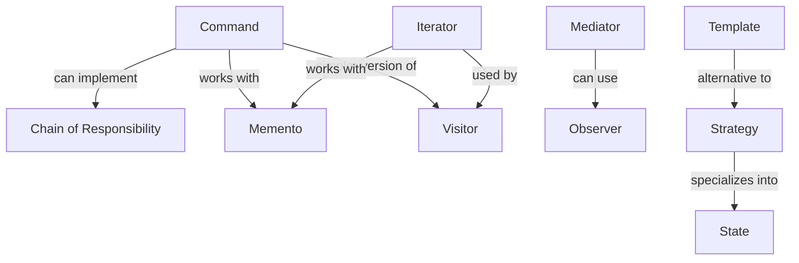
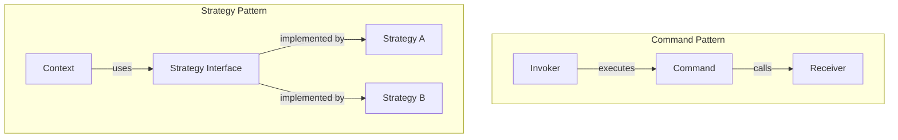
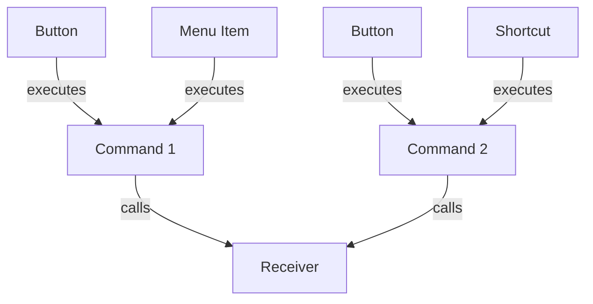
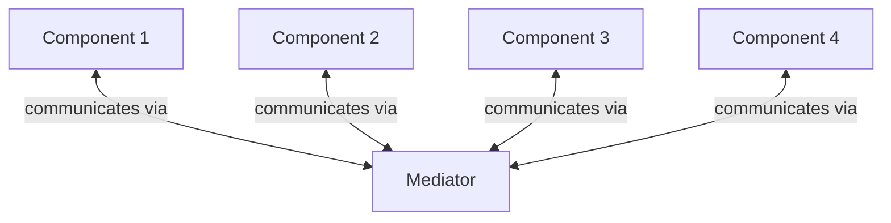
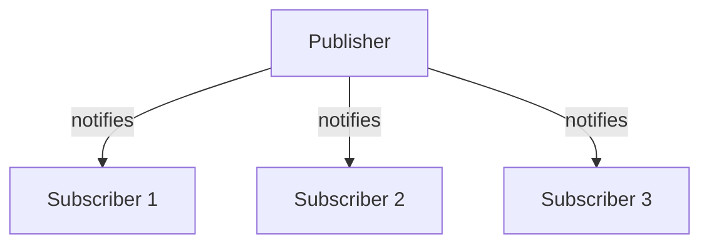
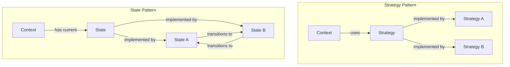
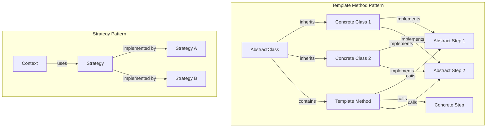
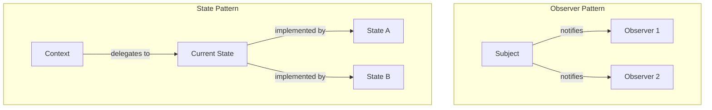

# Seeing the Forest, Not Just the Trees: Design Pattern Relationships

Have you ever learned individual design patterns but struggled to understand how they relate to each other? That was exactly my problem.

When reading Alexander Shvets' excellent book "Dive Into Design Patterns," I was particularly drawn to the "Relations with Other Patterns" section. This unique feature helps bridge the gap between knowing individual patterns and truly understanding their ecosystem.

I believe the journey of pattern mastery has three levels:
1. **What is this pattern?** (Basic understanding)
2. **Why use this pattern?** (Practical application)
3. **How does this pattern compare to similar ones?** (Deep comprehension)

While Shvets provides some pattern relationships, I felt there was room for a deeper exploration specifically among behavioral patterns. This post is my attempt to map the connections, similarities, and differences between these patterns to help fellow developers level up their design pattern knowledge.


This blog post doesn't dive into explanation of each behavioral design pattern.
This blog is solely about their <u>similarities</u>, <u>differences</u> and <u>relationships</u>.


# Behavioral Design Patterns

- `Chain of Responsibility`: lets you pass requests along a chain of handlers. Upon receiving a request, each handler decides either to process the request or to pass it to the next handler in the chain.
- `Command`: Turns a request into a stand-alone object that contains all information about the request. This transformation lets you parameterize methods with different requests, delay or queue a request's execution, and support undoable operations.
- `Mediator`: Lets you reduce chaotic dependencies between objects. The pattern restricts direct communications between the objects and forces them to collaborate only via a mediator object.
- `Observer`: Lets you define a subscription mechanism to notify multiple objects about any events that happen to the object they're observing.
- `Iterator`: Lets you traverse elements of a collection without exposing its underlying representation (list, stack, tree, etc.).
- `Memento`: Lets you save and restore the previous state of an object without revealing the details of its implementation.
- `State`: Lets an object alter its behavior when its internal state changes. It appears as if the object changed its class.
- `Strategy`: Lets you define a family of algorithms, put each of them into a separate class, and make their objects interchangeable.
- `Template Method`: Defines the skeleton of an algorithm in the superclass but lets subclasses override specific steps of the algorithm without changing its structure.
- `Visitor`: Lets you separate algorithms from the objects on which they operate.

# Similarities

All behavioral design patterns focus on communication between objects. They provide elegant solutions to common programming challenges related to object interaction.

Most behavioral patterns provide ways to change behavior without altering existing code, following the [Open/Closed Principle](https://en.wikipedia.org/wiki/Open%E2%80%93closed_principle).

Most patterns aim to reduce dependencies between objects, promoting loose coupling for more maintainable and flexible code.

# The Pattern Relationships Map

Before diving into specific comparisons, here's a high-level view of how these patterns relate to each other:

# Command

## Command vs. Strategy

`Command` decouples the object invoking an operation from the one performing it.
`Strategy` provides interchangeable algorithms.

Think of it this way:
- `Command` says: "I'll handle **what** needs to be done and **when**"
- `Strategy` says: "I'll handle **how** something gets done"

## Command vs. Memento

`Command` can work together with `Memento` for implementing "undo" functionality.
`Command`s handle operations while `Memento`s save the state before command execution.

It's like having both:
- A to-do list (commands)
- Snapshots of your room (mementos) before each task

## Command vs. Visitor

`Visitor` can be viewed as a powerful version of `Command`.
`Command` does a single operation. So if you want to add new features (which means new methods) to multiple classes, you need to add a new command for each class.
`Visitor` does multiple operations since it traverses over multiple objects. So if you want to add new features to multiple classes, you just need to create 1 more `Visitor`. All classes already have the `visit()` method in themselves.

## Command vs. Chain of Responsibility vs. Observer vs. Mediator

`Chain of Responsibility`, `Command`, `Mediator`, and `Observer` all address different ways of connecting senders and receivers.

In `Chain of Responsibility`, **single** sender sends messages **sequentially** and **unidirectional** to **single receiver**.

In `Command`,  **multiple** senders send messages **unidirectional** to a **single** receiver.

`Chain of Responsibility` can be implemented with `Command`. Each handler in `Chain of Responsibility` can be a command. This is helpful when multiple handlers are needed interchangeably. Like having multiple authentication handlers. each one executes a different authentication command.

In `Mediator`, **multiple** objects send messages **bidirectional** to **multiple** objects via a **central** object called `Mediator`.

In `Observer`, **single** sender sends messages **unidirectional** to **multiple** subscribed receivers.

`Mediator` can also be implemented with `Observer`. The mediator object acts as publisher and components as subscribers.

# Strategy

## Strategy vs. State

Both are based on composition and delegate work to helper objects.
`State` can be considered an extension of `Strategy` (Each `State` being an `Strategy`).
Strategy makes objects completely independent and unaware of each other.
But `State`s know each other and transition between each other. You can't expect a `Strategy` to change to another `Strategy` when it is executed.

## Strategy vs. Template Method

Both design patterns deal with using an algorithm.
In `Template Method` there is a **single** algorithm with multiple abstract and concrete steps. Subclasses of this `Template` implement their own steps from abstract steps. `Template Method` uses inheritance.
But In `Strategy` there are **multiple** algorithms. These algorithms don't share anything with each other. We can change the algorithm that we want at runtime via composition.

# Iterator

## Iterator vs. Visitor
They can be used together. In `Visitor` pattern we need to traverse over multiple different objects. This can be done effectively with `Iterator`.

A good analogy is:
- `Iterator` is like a tour guide who knows how to navigate through a museum
- `Visitor` is like a photographer who performs an action (taking photos) at each exhibit

## Iterator vs. Memento
1) You use the **Iterator** to traverse your collection
2) At any point, you can use the **Memento** to take a "snapshot" of the iterator's state (current position, traversal path, etc.)
3) If you encounter a problem later in the traversal, you can restore the iterator to its previous state using the saved memento

It's like having:
- A map with directions (Iterator)
- A bookmark that saves your place (Memento)

## Observer vs. State

Both involve state changes, but:
- In `Observer`, objects are notified when a subject's state changes
- In `State`, an object's behavior changes when its state changes

# When to Choose Which Pattern

Here's a quick decision guide:

- Need to pass a request through a series of processing objects? → **Chain of Responsibility**
- Need to encapsulate a request as an object? → **Command**
- Need to reduce dependencies between objects? → **Mediator**
- Need a subscription mechanism? → **Observer**
- Need to traverse a collection? → **Iterator**
- Need to capture an object's state? → **Memento**
- Need to change an object's behavior when its state changes? → **State**
- Need interchangeable algorithms? → **Strategy**
- Need to define an algorithm skeleton with customizable steps? → **Template Method**
- Need to add operations to objects without modifying them? → **Visitor**

# References

- Shvets, Alexander. [Dive Into Design Patterns](https://refactoring.guru/design-patterns/book). Refactoring.Guru, 2019.
- [Open/Closed Principle](https://en.wikipedia.org/wiki/Open%E2%80%93closed_principle)

