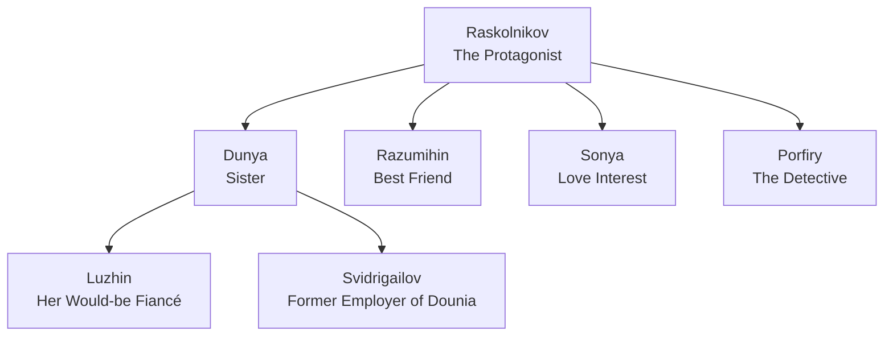

>What's the most offensive is not their lying—one can always forgive lying—lying is a delightful thing, for it leads to truth—what is offensive is that they lie and worship their own lying

>To go wrong in one's own way is better then to go right in someone else's.


This blog post doesn't give a summery of the book.
 
The main point of this blog post is to sort my insignificant thoughts about books that I read.


# Introduction
Have you ever wondered what drives someone to commit a terrible act in the name of a “greater good”?

Or felt torn between what society expects and what you believe is right? 

If so, you’re not alone – and you’re exactly the kind of person who’ll connect with Fyodor Dostoevsky’s Crime and Punishment.

# Characters
Here’s the thing about Crime and Punishment – it’s not really about the crime or the punishment. 
It’s about people. 
Each character represents different philosophies, values, and ways of seeing the world. 
By understanding them, we understand what Dostoevsky was trying to tell us about human nature.

## Avdotya Romanovna Raskolnikova (Dunya)
Raskolnikov’s sister Dunya embodies the conflict between personal happiness and family duty.

She’s intelligent, beautiful, and principled – but also willing to marry a man she doesn’t love to save her family from poverty.

>For herself (Dunya), for her comfort, to save her life she would not sell herself, but for someone else she is doing it! For one she loves, for one she adores, she will sell herself! That's what it all amounts to; for her brother, for her mother, she will sell herself! She will sell everything!

**What She Teaches Us**: Sometimes the most noble-seeming sacrifices can be their own form of pride. 
Is Dunya truly selfless, or is she martyring herself? Dostoevsky leaves this question open for us to ponder.

## Rodion Romanovich Raskolnikov (Rodya) – The Troubled Protagonist
### Dangers of Radical Abstract Thinking (Overthinking)
Our main character is a former law student who’s developed a dangerous theory. 
He’s written an article dividing humanity into two categories:
- Ordinary people: The masses who follow rules and social norms
- Extraordinary people: The rare few who have the right to transgress laws for the greater good
  
Sound familiar? If you’re thinking of certain historical figures who believed they were above common morality, you’re on the right track. 
Raskolnikov specifically admires Napoleon:

> Napoleon attracted him tremendously, that is, what affected him was that a great many men of genius have not hesitated at wrongdoing, but have overstepped the law without thinking about it

### The Problem with playing the God
Here’s where Raskolnikov’s theory falls apart:

- **It’s All in His Head**: His ideas work perfectly in abstract theory but crumble when faced with messy human reality. He didn’t account for guilt, paranoia, or the simple fact that other people have their own minds and motives.
- **The Superiority Paradox**: Feeling superior is a trap. You need others to validate your superiority, but needing validation contradicts the very idea of being above others. It’s like trying to win a game where you’re the only player.
- **Isolation Is the Price**: By seeing himself as extraordinary, Raskolnikov pushes away everyone who cares about him – his mother, sister, and loyal friend Razumihin.

Question: **why did he commit murder?**

It wasn’t poverty or a Robin Hood complex.
Raskolnikov could have earned money honestly (his friend offers him translation work).
The murder was an experiment – a test to prove he belonged among the “extraordinary” people. A test which he doesn't pass.

## Razumihin – The Friend We All Need
If Raskolnikov represents intellectual pride gone wrong, Razumihin is its antidote. He’s everything his friend isn’t: warm, honest, hard-working, and genuinely good-hearted. While Raskolnikov theorizes about humanity, Razumihin actually helps people.

My favorite Razumihin moment? When he regrets speaking badly about someone behind their back:
>The most awful recollection of the previous day was the way he had shown himself "base and mean," not only because he had been drunk, but because he had taken advantage of the young girl's (Dunya) position to abuse her fiancé (Luzhin) in his (Razumihin) stupid jealousy, knowing nothing of their mutual relations and obligations and next to nothing of the man (Luzhin) himself.

**What He Teaches Us**: You don’t need a grand theory to be a good person. Sometimes the “ordinary” people – those who show up, work hard, and treat others well – are the real heroes.

## Pyotr Petrovich Luzhin – The Toxic "Nice Guy"

If you've ever encountered someone who does "good deeds" solely to hold them over people's heads, you've met a Luzhin. This wealthy lawyer wants to marry Dunya, but not out of love – he specifically seeks a poor, beautiful, educated woman who will be eternally grateful to him.

Raskolnikov calls him out perfectly:

> "Is it true that you told your fiancée... within an hour of her acceptance, that what pleased you most... was that she was a beggar... because it was better to raise a wife from poverty, so that you may have complete control over her, and reproach her with your being her benefactor?"

**The Mask Falls Off**

When Dunya rejects him, Luzhin's true nature explodes into view. He can't believe these "destitute and defenseless women" would dare escape his control. The narrator gives us a devastating portrait of his mindset:

Click to read Luzhin's full meltdown (it's a long but revealing passage)

> The fact was that up to the last moment he had never expected such an ending; he had been overbearing to the last degree, never dreaming that two destitute and defenceless women could escape from his control. This conviction was strengthened by his vanity and conceit, a conceit to the point of fatuity. Pyotr Petrovitch, who had made his way up from insignificance, was morbidly given to self-admiration, had the highest opinion of his intelligence and capacities, and sometimes even gloated in solitude over his image in the glass. But what he loved and valued above all was the money he had amassed by his labour, and by all sorts of devices: that money made him the equal of all who had been his superiors.
>
> When he had bitterly reminded Dounia that he had decided to take her in spite of evil report, Pyotr Petrovitch had spoken with perfect sincerity and had, indeed, felt genuinely indignant at such "black ingratitude." And yet, when he made Dounia his offer, he was fully aware of the groundlessness of all the gossip. The story had been everywhere contradicted by Marfa Petrovna, and was by then disbelieved by all the townspeople, who were warm in Dounia's defence. And he would not have denied that he knew all that at the time. Yet he still thought highly of his own resolution in lifting Dounia to his level and regarded it as something heroic. In speaking of it to Dounia, he had let out the secret feeling he cherished and admired, and he could not understand that others should fail to admire it too. He had called on Raskolnikov with the feelings of a benefactor who is about to reap the fruits of his good deeds and to hear agreeable flattery. And as he went downstairs now, he considered himself most undeservedly injured and unrecognised.
>
> Dounia was simply essential to him; to do without her was unthinkable. For many years he had had voluptuous dreams of marriage, but he had gone on waiting and amassing money. He brooded with relish, in profound secret, over the image of a girl—virtuous, poor (she must be poor), very young, very pretty, of good birth and education, very timid, one who had suffered much, and was completely humbled before him, one who would all her life look on him as her saviour, worship him, admire him and only him. How many scenes, how many amorous episodes he had imagined on this seductive and playful theme, when his work was over! And, behold, the dream of so many years was all but realised; the beauty and education of Avdotya Romanovna had impressed him; her helpless position had been a great allurement; in her he had found even more than he dreamed of. Here was a girl of pride, character, virtue, of education and breeding superior to his own (he felt that), and this creature would be slavishly grateful all her life for his heroic condescension, and would humble herself in the dust before him, and he would have absolute, unbounded power over her!... Not long before, he had, too, after long reflection and hesitation, made an important change in his career and was now entering on a wider circle of business. With this change his cherished dreams of rising into a higher class of society seemed likely to be realised.... He was, in fact, determined to try his fortune in Petersburg. He knew that women could do a very great deal. The fascination of a charming, virtuous, highly educated woman might make his way easier, might do wonders in attracting people to him, throwing an aureole round him, and now everything was in ruins!

**What He Teaches Us:** Luzhin represents the danger of transactional relationships and weaponized generosity. He doesn't want a partner; he wants a possession. In modern terms, he's the embodiment of toxic masculinity – using wealth and "benevolence" as tools of control. Watch out for anyone who keeps score of their "good deeds" or wants you to be perpetually grateful.

## Sonya Marmeladova – The Saint in Hell

Sonya might be the most heartbreaking character in the novel. Forced into prostitution to keep her alcoholic father's family from starving, she represents pure self-sacrifice – but also raises uncomfortable questions about suffering and redemption.

When Raskolnikov first truly sees her, he makes this dramatic declaration:

> "I did not bow down to you, I bowed down to all the suffering of humanity... I said just now to an insolent man (Luzhin) that he was not worth your little finger... and that I did my sister honour making her sit beside you."

### The Problem of Meaningless Suffering

Here's where Dostoevsky gets complex. Not all suffering leads to growth:

**Transformative Suffering:**
- Physical training → strength
- Emotional challenges → empathy
- Mental puzzles → intelligence

**Cruel, Useless Suffering:**
- Sonya's prostitution doesn't make her "better"
- She suffers from others' failures (her father's alcoholism)
- Her pain doesn't transform – it just hurts

## Arkady Ivanovich Svidrigailov – The Nightmare Version of Raskolnikov

If Raskolnikov represents someone struggling with nihilistic ideas, Svidrigailov shows us what happens when someone fully embraces them. He's wealthy, intelligent, and completely amoral – a true nihilist who's abandoned all traditional values.

His philosophy on manipulation is chillingly simple:

> "Finally resorted to the most powerful weapon in the subjection of the female heart, a weapon which never fails one. It's the well-known resource—flattery."

### The Nihilism Trap

Svidrigailov embodies both the freedom and the horror of believing in nothing:

**The Upside of Nihilism:**
- Complete freedom from social expectations
- No guilt or shame holding you back
- The ability to reinvent yourself at will

**The Devastating Downside:**
- **Crushing Boredom:** Without values or meaning, life becomes empty entertainment
- **Casual Wickedness:** No moral boundaries means justifying any cruel action
- **Spiritual Death:** Nothing matters, so why live?

### The Paradox That Breaks Him

Here's the twist: complete nihilism is impossible. We're human, not robots. Svidrigailov discovers this when he falls genuinely in love with Dunya. This real emotion contradicts everything he claims to believe. He can't reconcile his nihilistic worldview with his very human capacity for love.

Unable to abandon his philosophy but equally unable to ignore his feelings, he chooses the only escape he can see: suicide. It's Dostoevsky's ultimate argument against nihilism – even the most committed nihilist can't escape their humanity.

**What He Teaches Us:** Svidrigailov is a warning about the logical endpoint of "nothing matters" philosophy. He shows that humans need meaning, connection, and values to survive. Try to live as if nothing matters, and you'll discover that everything matters – especially love, which refuses to follow nihilistic rules.

# The Big Themes for Modern Readers
## The Danger of Radical Ideologies

Raskolnikov’s story warns us about any ideology that divides people into “worthy” and “unworthy” categories. 
Whether it’s based on intelligence, race, class, or any other factor, these divisions lead to dehumanization and violence.

## Actions Have Consequences (Even If No One Catches You)
The real punishment isn’t prison – it’s living with yourself. 
Raskolnikov’s guilt manifests as physical illness, paranoia, and isolation. The mind has its own justice system.

## Connection vs. Isolation
The novel shows how intellectual pride isolates us, while genuine human connection – even with flawed people – can save us. Raskolnikov’s path to redemption begins when he stops seeing others as beneath him.

## The Limits of Logic
Pure reason without empathy or moral grounding leads to monstrous conclusions. We need both head and heart to navigate life’s complexities.

# Why Read This Now?

In our age of social media echo chambers, radical online ideologies, and increasing isolation, Crime and Punishment feels surprisingly relevant. 
We see modern Raskolnikovs everywhere – people so convinced of their own righteousness that they justify terrible actions.

The novel reminds us that:
- Everyone deserves dignity and respect
- Intellectual brilliance without compassion is dangerous
- True strength comes from connection, not superiority
- Redemption is possible, but it requires humility

# Questions to Ponder Upon
- **Would not one tiny crime be wiped out by thousands of good deeds?**
- **why did Raskolnikov confess to Sonya about the murder?**

# What I disliked about the book
It was a long book filled with irrelevant details. It could have been shorter. I hate it when writers talk around the point.
# My Score
8 out of 10

# Meme Time
Congrats on reading this long ass review. Here's a meme for you:

# References
- Crime and Punishment, Fyodor Dostoevsky
- https://www.youtube.com/watch?v=bZWVp_qrD8o
- https://www.youtube.com/watch?v=Vtkv3-endYc
- https://www.youtube.com/watch?v=GAIenmb0Wvg
- https://www.youtube.com/watch?v=DKpibvZhr4k
- https://www.youtube.com/watch?v=7EfaIL3XPJI
- https://www.youtube.com/watch?v=2aGIhcaOJe0
- https://www.goodreads.com/book/show/7144.Crime_and_Punishment

