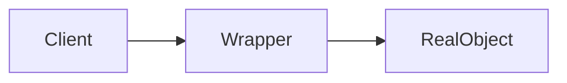
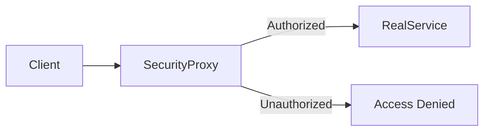
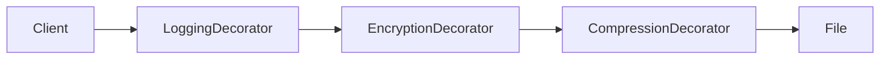


This blog post doesn't dive into explanation of each behavioral design pattern.
This blog is solely about their <u>similarities</u>, <u>differences</u> and <u>relationships</u>.
<br>
The main point of this blog post is to sort my insignificant thoughts about things that I learn.



# TL;Dr
Both Proxy and Decorator patterns **wrap objects** to modify behavior, but they serve different purposes. 
Decorators add new features (like adding toppings to a pizza), while Proxies control access or behavior (like a security guard at a building). 
Decorators can be stacked together, Proxies typically can’t. 
Use Decorator when you want to enhance functionality, use Proxy when you need to control or manage access.


# What Are Design Patterns Anyway? 🤔

Before we dive in, let’s quickly understand what design patterns are. 
Think of them as tried-and-tested recipes for solving common programming problems. 
Just like how there’s a standard way to make a sandwich, there are standard ways to structure your code to solve specific problems.


# Real-World Analogies First! 🌍
## Decorator Pattern = Pizza Toppings 🍕

Imagine you’re at a pizza place:
- You start with a basic pizza (your original object)
- You add pepperoni (+$2) - that’s one decorator
- You add extra cheese (+$1.50) - another decorator
- You add mushrooms (+$1) - yet another decorator

Each topping adds to your pizza without changing what a pizza fundamentally is. You can keep stacking toppings!
## Proxy Pattern = Security Guard 👮

Think of a proxy like a security guard at a fancy building:
    The guard checks if you have permission to enter
    They might log who goes in and out
    They control access to the actual building
    You can’t stack multiple guards - one is enough!


# Similarities
Both patterns wrap an object to modify how we interact with it:
1) They don’t change the interface - Both patterns implement the same interface as the object they’re wrapping
2) They introduce a middle layer - There’s always an intermediary between the client and the real object
3) They’re structural patterns - Both patterns deal with how objects are composed



# Key Differences 🔍

## 1. Required vs. Optional Dependency

**Decorator NEEDS an object to decorate:**
```java
// You MUST pass a file to decorate
FileDecorator decorator = new CompressionDecorator(actualFile);
// Without actualFile, the decorator is useless!
```

**Proxy can exist without the real object:**
```java
// Proxy can create the expensive object later (lazy loading)
ImageProxy proxy = new ImageProxy("huge-image.jpg");
// The actual image isn't loaded until you really need it
proxy.display(); // NOW it loads the image
```

## 2. Additive vs. Controlling

**Decorators ADD functionality:**
```java
// Original file behavior + compression
CompressedFile = new CompressionDecorator(file);
// Original behavior is preserved, just enhanced

// Like adding whipped cream to coffee - still coffee, just better!
```

**Proxies CONTROL access or behavior:**
```java
// Proxy might deny access entirely
SecureFile = new SecurityProxy(file);
secureFile.read(); // Might throw "Access Denied!"

// Like a bouncer at a club - you might not get in at all!
```




## 3. Class Chaining

**Decorators are meant to be stacked:**
```java
// Start with basic file
File myFile = new File("document.txt");

// Add compression
File compressedFile = new CompressionDecorator(myFile);

// Add encryption on top of compression
File secureCompressedFile = new EncryptionDecorator(compressedFile);

// Add logging on top of everything
File fullyDecoratedFile = new LoggingDecorator(secureCompressedFile);
```



**Proxies typically work alone:**
```java
// Just one proxy is enough
File secureFile = new SecurityProxy(new File("secret.txt"));

// Multiple proxies? Usually not needed and can get confusing
// (Though technically possible, it's rarely done)
```

# When to Use Which? 🤷

## Use Decorator When:
- You want to add responsibilities to objects dynamically
- You need to add multiple functionalities that can be combined
- You want to extend functionality without modifying existing code
- Example: Adding filters to images, adding features to text editors

## Use Proxy When:
- You need to control access to an object
- You want to add lazy initialization (load expensive resources only when needed)
- You need to log access or add security checks
- You want to hide the complexity of the real object
- Example: Database connections, network requests, access control

# Common Use Cases in Real Apps 💻

## Decorator in the Wild:
- **Java I/O Streams**: `BufferedInputStream(FileInputStream)`
- **UI Components**: Adding scroll bars, borders to windows
- **Web Development**: Middleware in Express.js

## Proxy in the Wild:
- **Spring Framework**: AOP proxies for transactions
- **Hibernate**: Lazy loading of entities
- **JavaScript**: Proxy objects for reactive frameworks

# Conclusion 🎯

While Proxy and Decorator patterns might look similar at first glance (both wrap objects), they serve very different purposes:

- **Decorator** = Enhancement 🎨 (Make it better)
- **Proxy** = Control 🚦 (Manage access/behavior)

Remember: Decorators are like Instagram filters - you can stack many to enhance your photo. Proxies are like security systems - one good system is usually enough!

# Practice Exercise 🏋️

Try implementing both patterns for a simple `DataSource` interface:
1. Create decorators for compression and encryption
2. Create a proxy for caching frequently accessed data
3. Notice how decorators stack but the proxy stands alone

Happy coding! 🚀

---

## References & Further Reading 📚

### Core Design Pattern Resources:
- [Design Patterns: Elements of Reusable Object-Oriented Software](https://en.wikipedia.org/wiki/Design_Patterns) - The original "Gang of Four" book that started it all
- [Refactoring Guru - Proxy Pattern](https://refactoring.guru/design-patterns/proxy) - Interactive examples with diagrams and code in multiple languages
- [Refactoring Guru - Decorator Pattern](https://refactoring.guru/design-patterns/decorator) - Step-by-step visual guide to implementing decorators

### Beginner-Friendly Resources:
- [Head First Design Patterns](https://www.oreilly.com/library/view/head-first-design/0596007124/) - Uses humor and visuals to explain patterns
- [Source Making - Structural Patterns](https://sourcemaking.com/design_patterns/structural_patterns) - Comprehensive explanations with real-world examples

### Video Tutorials:
- [Derek Banas - Design Patterns Tutorial](https://www.youtube.com/playlist?list=PLF206E906175C7E07) - Quick video explanations of each pattern
- [Christopher Okhravi - Design Patterns](https://www.youtube.com/playlist?list=PLrhzvIcii6GNjpARdnO4ueTUAVR9eMBpc) - In-depth discussions with whiteboard explanations


