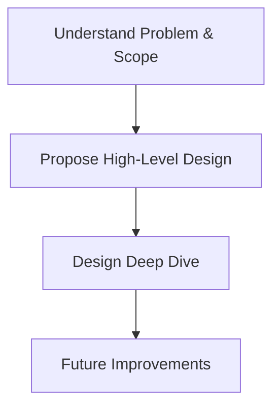

**Author**: Alex Xu

# Introduction
Feeling overwhelmed by system design interviews? System Design Interview – An Insider’s Guide by Alex Xu is here to help! Spanning 16 chapters with 12 real-world examples, this book breaks down complex concepts into digestible steps. The first chapter gets you up to speed on key topics like scalability, databases, load balancers, caching, CDNs, and message queues—core components of any system. In Chapter 2, Alex introduces back-of-the-envelope estimation, teaching you how to gauge a system’s performance or resource needs quickly. Whether you’re prepping for an interview or aiming to level up as a software engineer, this book is a game-changer.

# Designs Explained in the Book
The book covers practical system design problems, including:
- Rate Limiter
- Consistent Hashing
- Key-value Store
- Unique Id Generator In Distributed System
- Url Shortener
- Web Crawler
- Notification System
- News Feed System
- Chat System
- Search Autocomplete System
- YouTube
- Google Drive

Alex explains these designs with clear examples and visuals, so I’ll let the book speak for itself!

# Who Should Read This Book?
This book is perfect for junior developers, interview candidates, or anyone transitioning to a senior software engineer role. If you’re intimidated by designing systems like YouTube or a web crawler, Alex’s structured approach will give you confidence.

# What I Liked
**System Design Framework**: The book provides a clear framework for tackling system design interviews, breaking down a broad topic into four steps:
- Understand the problem and establish design scope: Don’t assume you know the answer. Ask questions to clarify constraints that affect your design.
- Propose high-level design and get buy-in: Sketch your design, show how components interact, and seek feedback.
- Design deep dive: Dive into each component, detailing algorithms and trade-offs.
- Future improvements: Suggest future features or optimizations if time allows.

Here’s a flowchart of the framework:

**Practical Examples**: Each concept is followed by real-world examples, making abstract ideas concrete.
**Naive vs. Better Approaches**: Alex starts with a simple (naive) approach, highlights its drawbacks, then introduces optimized solutions. This taught me to explore multiple options instead of settling for the first idea.

| Approach        | Naive                                        | Improved                                      |
| --------------- | -------------------------------------------- | --------------------------------------------- |
| Key-Value Store | Single server, no replication                | Distributed with replication and partitioning |
| Drawbacks       | Limited scalability, single point of failure | Handles high traffic, fault-tolerant          |
| Benefits        | Simple to implement                          | Scales with demand                            |

**Straight to the Point**: The book focuses on the big picture without drowning in details—a must for senior engineers who need to see the forest, not just the trees.

**References for Deep Dives**: Each chapter includes references for further reading, and the final chapter, The Learning Continues, suggests additional resources.

# What I Disliked
Nothing to think of right now. I will update this section If I find any shortcomings.

# My Score
10/10. A must-read for aspiring senior software engineers. Alex has also written a second volume, which I haven’t read yet but am excited to explore!

# Key Takeaways
- A structured framework simplifies even the toughest system design problems.
- Always consider multiple approaches to a design, weighing trade-offs.
- The big picture matters more than nitty-gritty details in system design.

# References
- [System Design Interview – An Insider’s Guide by Alex Xu](https://amzn.eu/d/iNXahtH)